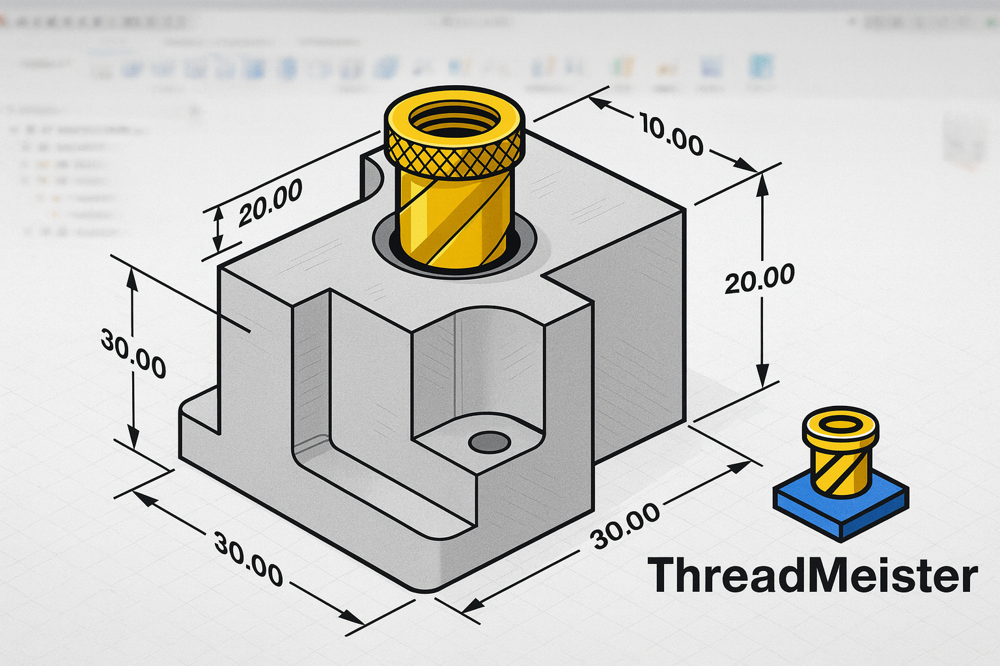
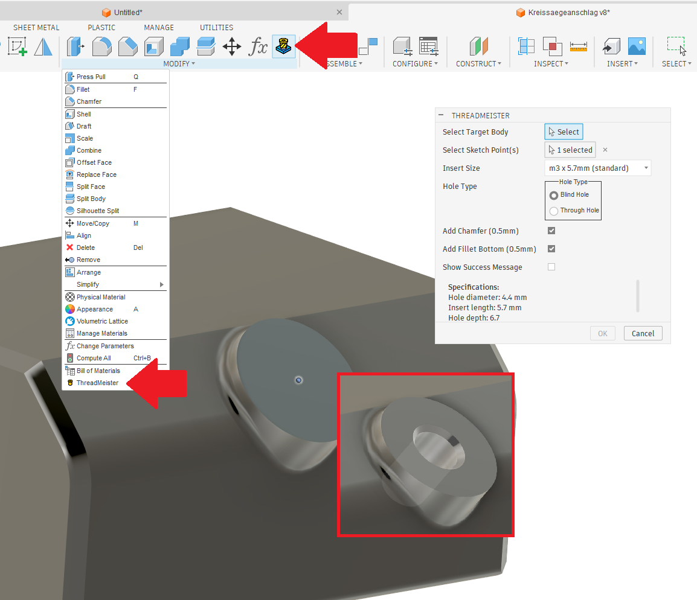
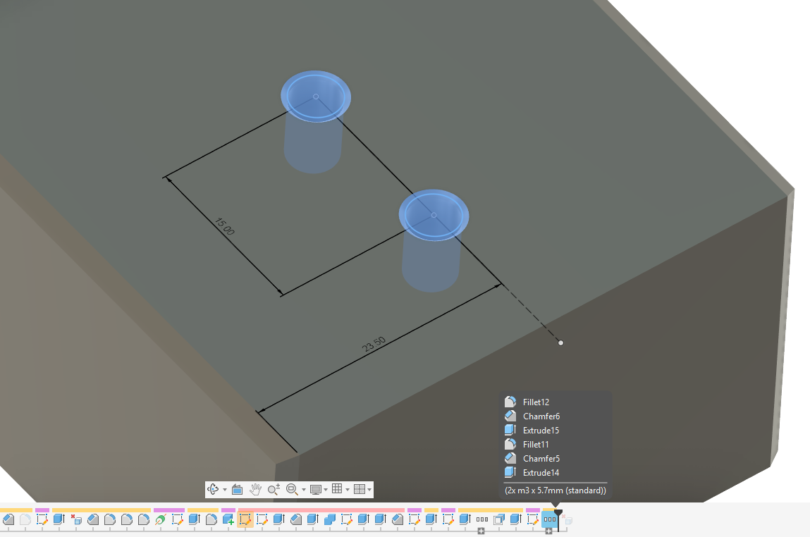

# ThreadMeister – Fusion 360 Heat-Set Inserts for 3D Printing

ThreadMeister is a Fusion 360 add-in that automates the creation of correctly dimensioned heat-set insert holes for 3D-printed parts directly in your solid models.
It uses insert dimension recommendations from [CNC Kitchen](https://cnckitchen.com), based on extensive testing and real-world data.
Choose from preconfigured insert sizes (M2–M10 and 1/4"-20) or define your own in a simple config file.
The add-in supports blind and through holes, automatic chamfers and fillets, and multi-point hole creation with clean, grouped timeline entries.
This makes it ideal for designers who frequently use threaded inserts in 3D-printed parts and want consistent, reliable holes with minimal manual setup.

  

---

## Features

- Pre‑configured insert sizes based on CNC Kitchen recommendations (M2–M10 and 1/4"-20)
- Blind and through holes with automatically calculated depths
- Automatic top chamfer (0.5 mm × 45°; fully customizable)
- Automatic bottom fillet (0.5 mm radius; fully customizable)
- Multi‑point hole creation
- Clean, grouped timeline entries
- Direct integration in **SOLID → MODIFY**
- Intuitive, user‑friendly dialog
- Insert specifications can be customized or extended through a simple configuration file

---

## Platform Support

- **Windows:** Fully tested  
- **macOS:** Not yet fully tested; feedback is welcome. 
  - Cross‑platform file paths  
  - No Windows‑specific APIs  
  - Geometry creation expected to behave identically  

---

## How It Works

1. Create a sketch and place sketch points or use existing line/arc endpoints where insert holes should be created.  
2. Finish the sketch.  
3. In the SOLID workspace, open **MODIFY → ThreadMeister**.  
4. Select the target body.  
5. Select one or more sketch points or endpoints.  
6. Choose insert size and hole type (blind or through).  
7. Choose top chamfer and bottom fillet if desired (both recommended)
8. Confirm with **OK**.

ThreadMeister automatically generates the correct bore diameter, depth, chamfer, and optional bottom fillet.

---

## Insert Specifications

All insert dimensions follow CNC Kitchen’s official recommendations (custom definitions can be added in config file).  
Blind holes include an additional 1 mm clearance depth (additional depth can be configured in config file).

---

## Screenshots

   
  <strong>Easy configuration of holes based on insert specifications</strong>

 

   
  <strong>Bore is fully associated with sketch dimensions</strong>

---

## Requirements

- Autodesk Fusion 360  
- Python support (included with Fusion 360)  
- Windows or macOS  

---

## Known Issues

In very complex sketches with many intersecting lines near the hole position,
Fusion 360 may fail to create the bore, chamfer, or fillet.
Create the hole in a simpler sketch (or a separate sketch) to avoid this issue.

---

## Credits

- Developer: Andreas Kircher  
- Insert specifications: CNC Kitchen  
- Code assistance: CAI‑assisted coding  

---

## License

ThreadMeister is licensed under the **GNU General Public License v3.0 (GPL‑3.0)**.  
A copy of the license is included in the package.

---

## Disclaimer

This add‑in is not affiliated with CNC Kitchen or Autodesk.  
Always verify dimensions for your specific application.
